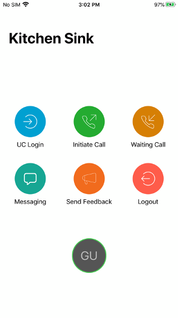
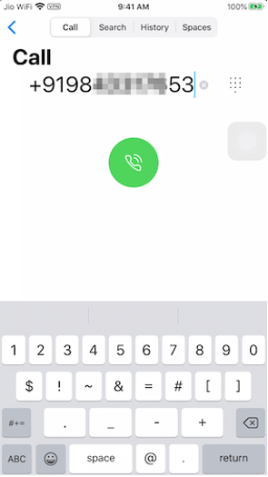
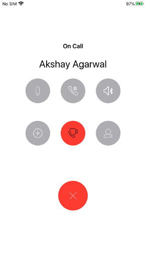
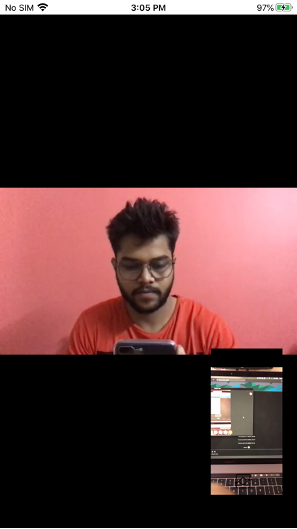
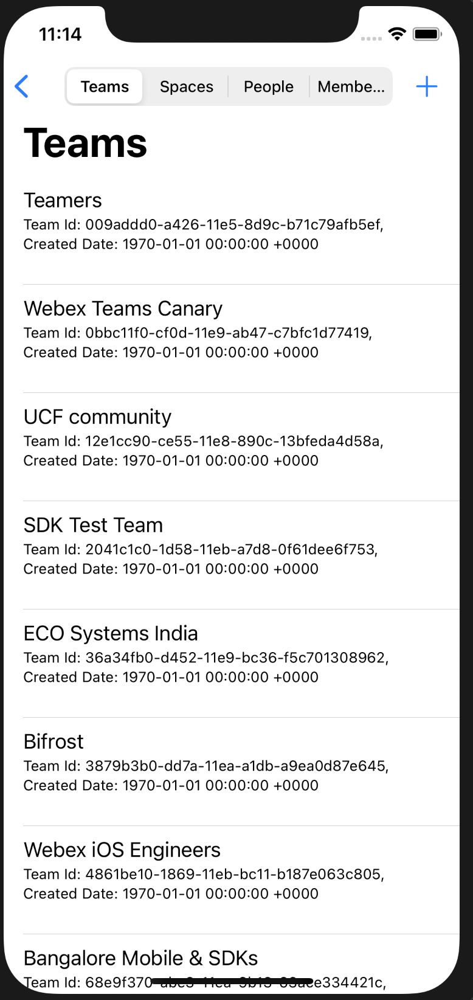
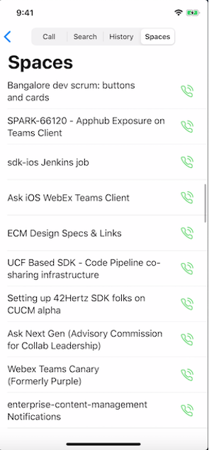
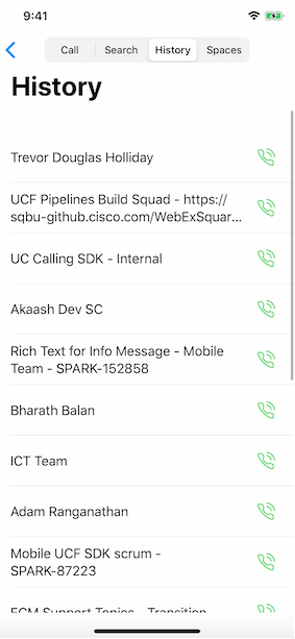
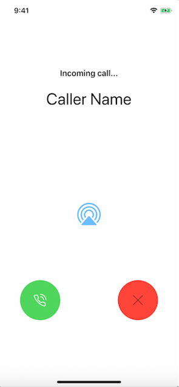

# Cisco Webex iOS SDK Example

Kitchen Sink is a developer friendly sample implementation of Webex client SDK and showcases all SDK features. It focuses on how to call and use *Webex-SDK* APIs. Developers could directly cut, paste, and use the code from this sample. It basically implements *Webex-SDK* APIs by sequence.

## Screenshots 
<ul>








</ul>

1. ScreenShot-1: Main page of Application, listing main functions of this demo.
1. ScreenShot-2: Call initiating screen.
1. ScreenShot-3: Call connected screen and other call related controls.
1. ScreenShot-4: Video calling screen.
1. ScreenShot-5: Search Spaces screen.
1. ScreenShot-6: Space listing and other space options.
1. ScreenShot-7: Call history screen.
1. ScreenShot-8: Incoming call screen.

## Setup
Here are the steps to setup Xcode project using [CocoaPods](http://cocoapods.org):

1. Install CocoaPods:
    ```bash
    gem install cocoapods
    ```

1. Setup Cocoapods:
    ```bash
    pod setup
    ```

1. Install WebexSDK and other dependencies from your project directory:

    ```bash
    pod install
    ```
## Example
For example see [README.md](https://github.com/webex/webex-ios-sdk/blob/v3-beta/README.md)


### Instructions

1. Add **Secrets.plist** file in your project and add following fields:
    ```
    CLIENTID
    CLIENT SECRET
    REDIRECT URI
   ```

2. Enabling and using screen share on your iPhone

    - Add screen recording to control center:

      1. Open Settings -> Control Center -> Customize Controls

      2. Tap '+' on Screen Recording

    - To share your screen in KitchenSink:

      1. Swipe up to open Control Center

      2. Long press on recording button

      3. select the KitchenSinkBroadcastExtension, tap Start Broadcast button

