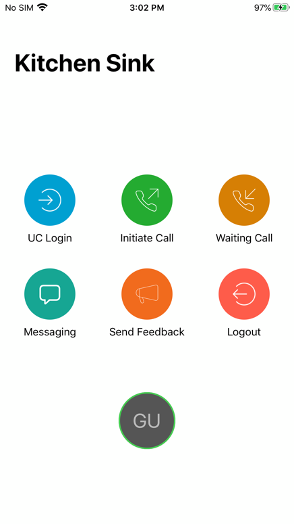
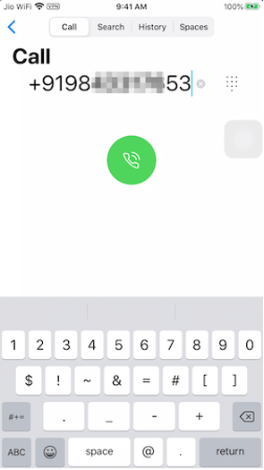
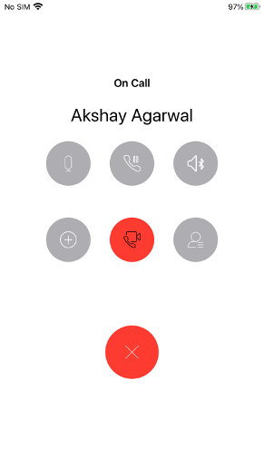
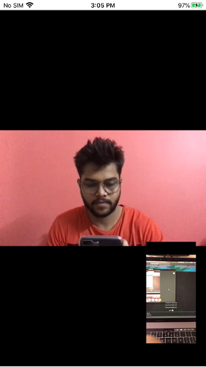
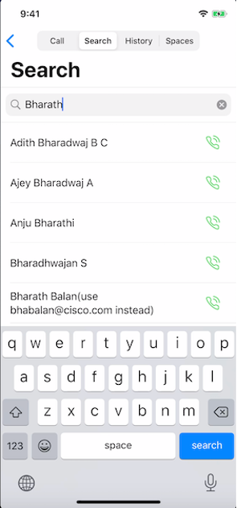
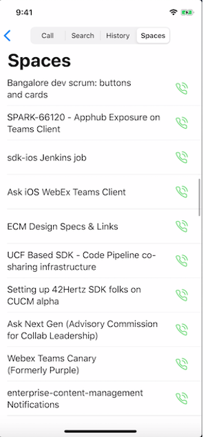
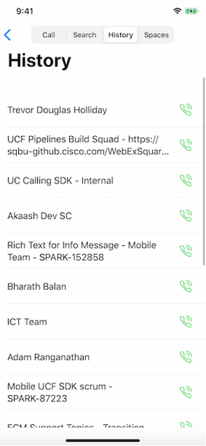
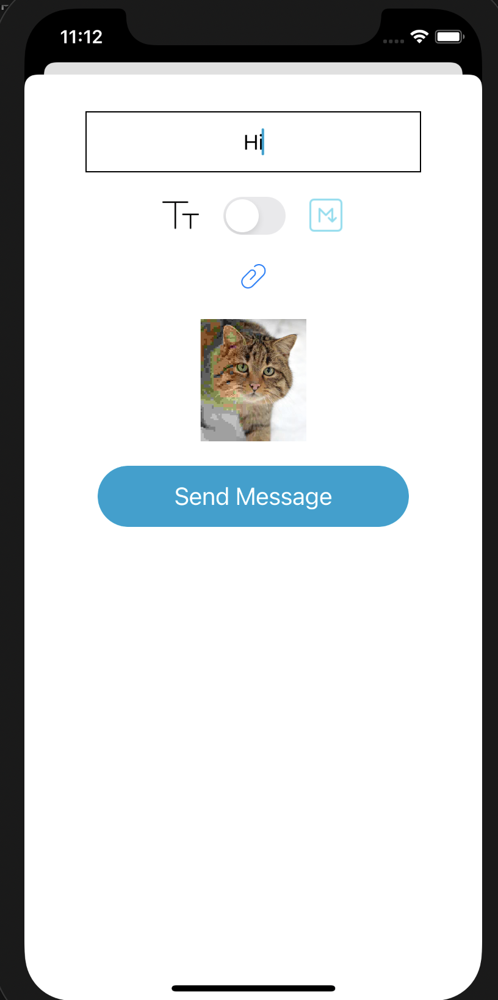
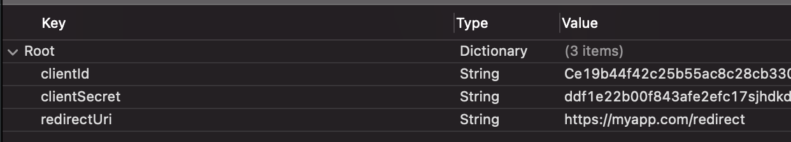

# Cisco Webex iOS SDK Example

This *Kitchen Sink* demo employs Cisco Webex service through [Webex iOS SDK](https://github.com/webex/webex-ios-sdk).  It provides a developer friendly sample implementation of Webex client SDK and showcases all SDK features. It focuses on how to call and use *Webex-SDK* APIs. Developers could directly cut, paste, and use the code from this sample.

This demo supports iOS device with **iOS 13** or later

## Table of Contents

  - [Screenshots](#screenshots)
  - [Download App](#download-app)
  - [Setup](#setup)
  - [Usage](#usage)
  - [API Reference](#api-reference)


## Screenshots 
<ul>








</ul>

1. ScreenShot-1: Main page of Application, listing main functions of this demo.
1. ScreenShot-2: Initiate call page.
1. ScreenShot-3: Show call controls when call is connected.
1. ScreenShot-4: Video calling screen 
1. ScreenShot-5: Teams listing screen
1. ScreenShot-6: Space listing screen
1. ScreenShot-7: Space related option screen
1. ScreenShot-8: Send Message screen

## Download App
You can download our Demo App from TestFlight.
1. Download TestFlight from App Stroe.
1. Contact Webex Dev Support to get access to the KitchenSink-Beta builds.
1. Start Testing and install Ktichen Sink App from TestFlight.

## Setup

Here are the steps to setup Xcode project using [CocoaPods](http://cocoapods.org):

1. Download WebexSDK and WebexBroadcastExtensionKit zip from here https://github.com/webex/webex-ios-sdk/tree/Beta/3.4.0 and extract the contents inside the Frameworks folder in root of this repo.


1. Install CocoaPods:
    ```bash
    gem install cocoapods
    ```

1. Setup Cocoapods:
    ```bash
    pod setup
    ```

1. Install WebexSDK and other dependencies from your project directory:

    ```bash
    pod install
    ```

1. To the app’s `Info.plist`, please add an entry `GroupIdentifier` with the value as your app's GroupIdentifier. This is required so that we can get a path to store the local data warehouse. Note: You'll need to claim your own GroupIdentifier from Apple developer site.

1. If you'll be using [WebexBroadcastExtensionKit](https://cocoapods.org/pods/WebexBroadcastExtensionKit), You also need to add an entry `GroupIdentifier` with the value as your app's GroupIdentifier to your Broadcast Extension target. This is required so that we that we can communicate with the main app for screen sharing.

1. Modify the `Signing & Capabilities` section in your xcode project as follows 


## Usage

1. Add **Secrets.plist** file in your project and add following fields:
    ```
    clientId
    clientSecret
    redirectUri
   ```
   

1. Enabling and using screen share on your iPhone

    - Add screen recording to control center:

      1. Open Settings -> Control Center -> Customize Controls

      1. Tap '+' on Screen Recording

    - To share your screen in KitchenSink:

      1. Swipe up to open Control Center

      1. Long press on recording button

      1. select the KitchenSinkBroadcastExtension, tap Start Broadcast button

## API Reference
For complete API Reference, see [documentation](https://webex.github.io/webex-ios-sdk/)
