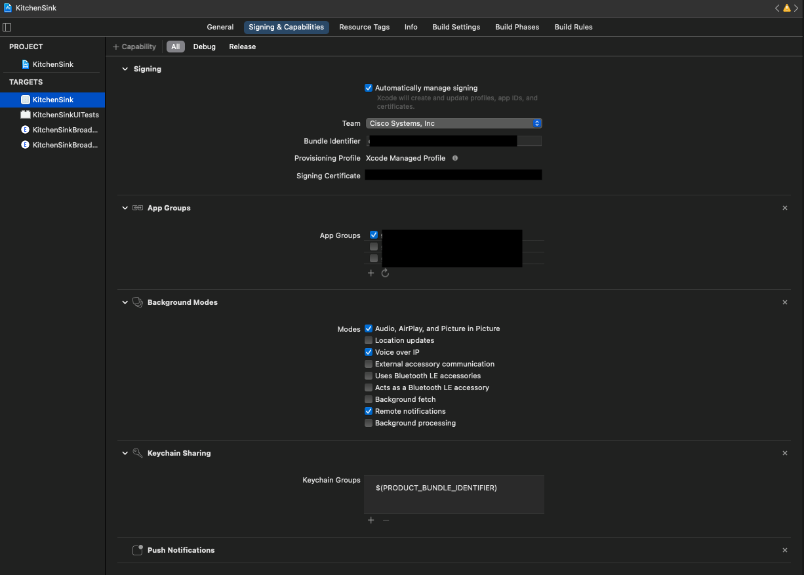

# Cisco Webex iOS SDK Example

Kitchen Sink is a developer friendly sample implementation of Webex client SDK and showcases all SDK features. It focuses on how to call and use *Webex-SDK* APIs. Developers could directly cut, paste, and use the code from this sample. It basically implements *Webex-SDK* APIs by sequence.

## Screenshots 
<ul>


</ul>

1. ScreenShot-1: Main page of Application, listing main functions of this demo.
1. ScreenShot-2: Call initiating screen.
1. ScreenShot-3: Call connected screen and other call related controls.
1. ScreenShot-4: Video calling screen.
1. ScreenShot-5: Search Spaces screen.
1. ScreenShot-6: Space listing and other space options.
1. ScreenShot-7: Call history screen.
1. ScreenShot-8: Incoming call screen.

## Integration
Here are the steps to setup Xcode project:

1. Drag and drop the `webexsdk.framework`, `util_ios.framework`, `wbxaecodec.framework`, `wbxaudioengine.framework` file into your app project
2. Set these frameworks as `Embed & Sign` in your app target
3. set `ENABLE_BITCODE=No`
4. Modify the `Signing & Capabilities` section in your xcode project as follows


5. In Info.plist update the `GroupIdentifier` to your App Group Identifier
6. Add **Secrets.plist** file in your project and add following fields:
    ```
    clientId
    clientSecret
    redirectUri
   ```
   
   
## Reference
For reference see [README.pdf](https://cisco.box.com/shared/static/09vqxhwsah1jdmo7pt3qrt29lhjicijb.pdf)
