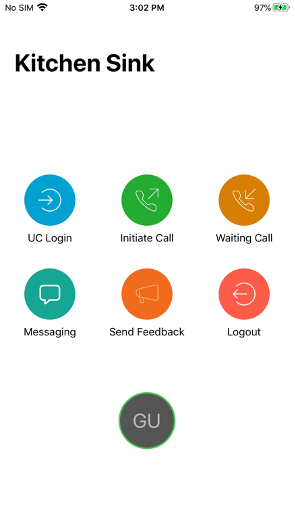
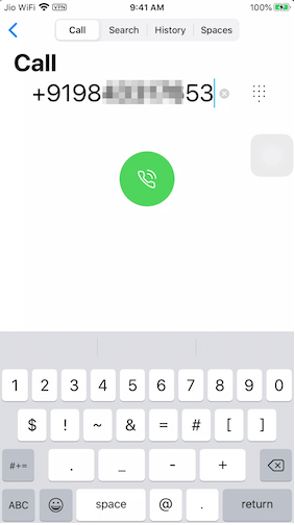
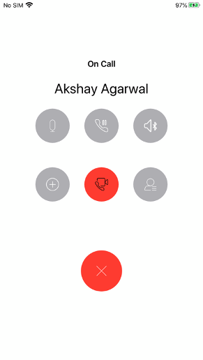
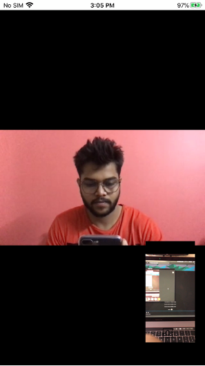
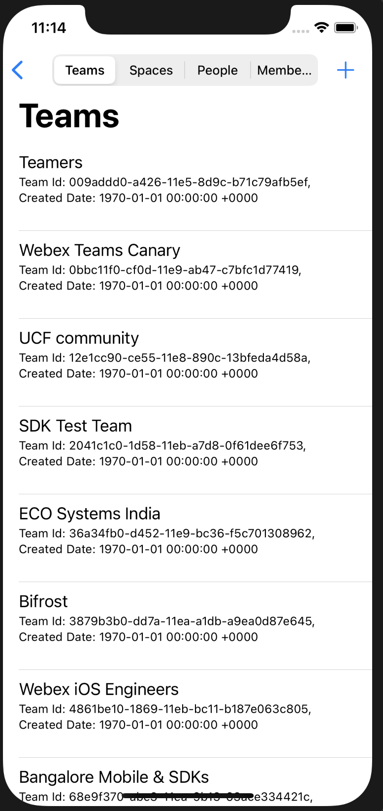
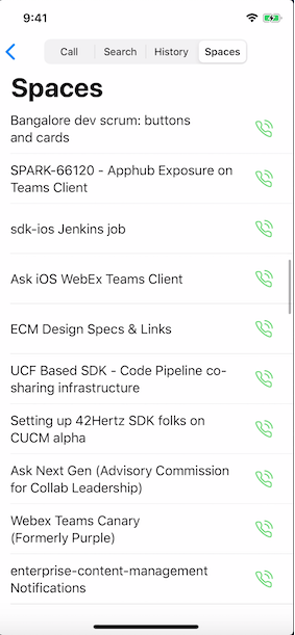
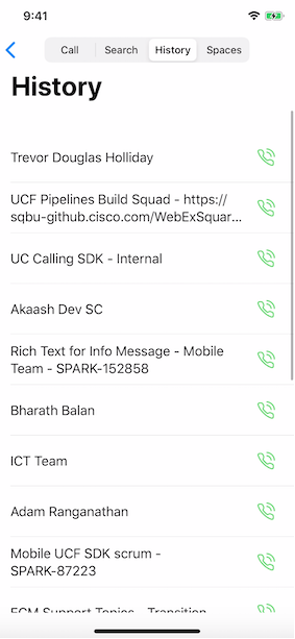
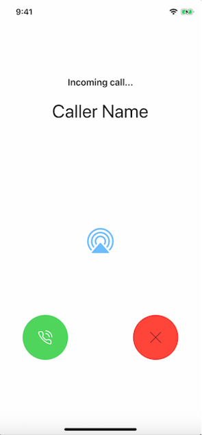
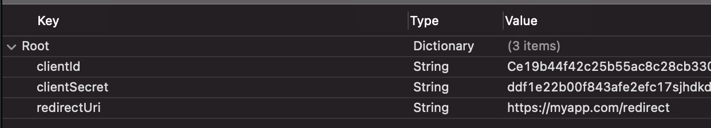

# Cisco Webex iOS SDK Example

This *Kitchen Sink* demo employs Cisco Webex service through [Webex iOS SDK](https://github.com/webex/webex-ios-sdk).  It provides a developer friendly sample implementation of Webex client SDK and showcases all SDK features. It focuses on how to call and use *Webex-SDK* APIs. Developers could directly cut, paste, and use the code from this sample.

This demo supports iOS devices with **iOS 13** or later when the SDK is integrated using CocoaPods, and **iOS 15** or later when it is integrated using Swift Package Manager.

## Table of Contents

- [Download App](#download-app)
- [Setup](#setup)
    - [Using CocoaPods](#using-cocoapods)
    - [Using Swift Package Manager](#using-swift-package-manager)
    - [Project configuration](#project-configuration)
- [Usage](#usage)
- [API Reference](#api-reference)


## Screenshots 
<ul>








</ul>

1. ScreenShot-1: Main page of Application, listing main functions of this demo.
1. ScreenShot-2: Initiate call page.
1. ScreenShot-3: Show call controls when call is connected.
1. ScreenShot-4: Video calling screen 
1. ScreenShot-5: Teams listing screen
1. ScreenShot-6: Space listing screen
1. ScreenShot-7: Space related option screen
1. ScreenShot-8: Send Message screen

## Download App
You can download our Demo App from TestFlight.
1. Download TestFlight from App Store.
1. Open the public url(https://testflight.apple.com/join/obJ7Inof) from your iPhone browser.
1. Start Testing and install Ktichen Sink App from TestFlight.

## Setup

The Webex iOS SDK can be integrated using either [CocoaPods](http://cocoapods.org) or [Swift Package Manager](https://swift.org/package-manager/). Both channels deliver the same binaries, and in both cases you write `import WebexSDK` in your code.

- **CocoaPods** — available for WebexSDK releases published up to 2 December 2026. Minimum iOS deployment target 13.0. This is how the KitchenSink project is configured out of the box.
- **Swift Package Manager** — available from WebexSDK `3.17.0` onward. Requires Xcode 15 or later and a minimum iOS deployment target of 15.0. Releases `3.16.2` and earlier are CocoaPods only.

> **Important — CocoaPods stops accepting new versions on 2 December 2026.**
> The CocoaPods trunk becomes permanently read-only on that date, as announced in the [CocoaPods Trunk Read-only Plan](https://blog.cocoapods.org/CocoaPods-Specs-Repo/). WebexSDK releases published after that date will be available through Swift Package Manager only. Existing Podfiles continue to resolve the versions published before the cutoff, so current builds will not break.

### Using CocoaPods

1. Install CocoaPods:
    ```bash
    gem install cocoapods
    ```

1. Setup Cocoapods:
    ```bash
    pod setup
    ```

1. Install WebexSDK and other dependencies from your project directory:

    ```bash
    pod install
    ```

1. Open the generated `KitchenSink.xcworkspace` in Xcode.

1. To use a lighter SDK flavor (Meeting, Calling, or Message only), uncomment the matching line in the `Podfile`, comment out `pod 'WebexSDK'`, and run `pod install` again.

### Using Swift Package Manager

To build KitchenSink with Swift Package Manager instead of CocoaPods:

1. Remove the CocoaPods integration from the project directory, then delete the `Podfile`, `Podfile.lock`, and `KitchenSink.xcworkspace` if present:

    ```bash
    pod deintegrate
    ```

1. Open `KitchenSink.xcodeproj` in Xcode.

1. Choose **File ▸ Add Package Dependencies…** and enter the package URL:

    ```
    https://github.com/webex/webex-ios-sdk
    ```

1. Set the dependency rule to **Up to Next Major Version** starting at `3.17.0`.

1. Add the products to the targets as follows:

    | Target | Product |
    | --- | --- |
    | `KitchenSink` | `WebexSDK` |
    | `KitchenSinkBroadcastExtension` | `WebexBroadcastExtensionKit` |

Add only **one** WebexSDK product to the app target. The products map to the CocoaPods flavors as follows:

| Swift Package Manager product | Equivalent pod |
| --- | --- |
| `WebexSDK` | `pod 'WebexSDK'` (Full) |
| `WebexSDKMeeting` | `pod 'WebexSDK/Meeting'` |
| `WebexSDKWxc` | `pod 'WebexSDK/Wxc'` |
| `WebexSDKMessage` | `pod 'WebexSDK/Message'` |
| `WebexBroadcastExtensionKit` | `pod 'WebexBroadcastExtensionKit'` |

Whichever WebexSDK product you pick, the module name is always `WebexSDK`, so no source changes are needed in KitchenSink. For the full walkthrough, see [Integrating SDK with App using Swift Package Manager](https://github.com/webex/webex-ios-sdk/wiki/Integrating-SDK-with-App-using-Swift-Package-Manager).

### Project configuration

These steps apply to both CocoaPods and Swift Package Manager setups.

1. To the app’s `Info.plist`, please add an entry `GroupIdentifier` with the value as your app's GroupIdentifier. This is required so that we can get a path to store the local data warehouse. Note: You'll need to claim your own GroupIdentifier from Apple developer site.

1. If you'll be using `WebexBroadcastExtensionKit`, you also need to add an entry `GroupIdentifier` with the value as your app's GroupIdentifier to your Broadcast Extension target. This is required so that we that we can communicate with the main app for screen sharing.

1. Modify the `Signing & Capabilities` section in your xcode project as follows 


## Usage

1. Add **Secrets.plist** file in your project and add following fields:
    ```
    clientId
    clientSecret
    redirectUri
   ```
   

1. Enabling and using screen share on your iPhone

    - Add screen recording to control center:

      1. Open Settings -> Control Center -> Customize Controls

      1. Tap '+' on Screen Recording

    - To share your screen in KitchenSink:

      1. Swipe up to open Control Center

      1. Long press on recording button

      1. select the KitchenSinkBroadcastExtension, tap Start Broadcast button

## API Reference
For complete API Reference, see [documentation](https://webex.github.io/webex-ios-sdk/)

## Privacy Manifest
In order to use WebexSDK in your iOS app, .xcprivacy file should be added to your application. Privacy manifest file can be found in [here](https://github.com/webex/webex-ios-sdk-example/blob/master/KitchenSink/PrivacyInfo.xcprivacy). 
